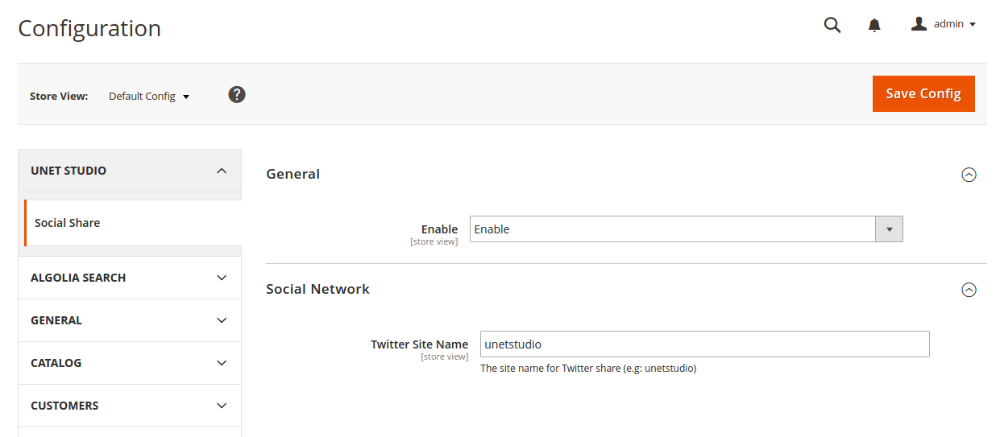

# Magento 2 Social Share

Social share toolbar for Magento 2 site


Documentation & demo
--------------

Live demo on [http://magento2.newbie-dev.net/](http://magento2.newbie-dev.net/)

Install
------------

The easiest way to install the extension is to use [Composer](https://getcomposer.org/).

Run the following commands:

- ```$ composer require unetstudio/magento-2-social-share```
- ```$ php bin/magento module:enable Unet_SocialShare```
- ```$ php bin/magento setup:upgrade```
- ```$ php bin/magento setup:static-content:deploy```

### Enable

Go to Admin > Store > Configuration > Unet Studio > Social Share:

- In General section, set value of Global Mode to 'Yes' to enable share toolbar in all pages, else the share toolbar just show by a widget.

### Features

- Open graph meta for Facebook, Google Plus, Pinterest.

- Twitter card meta.

- Social share toolbar in the frontend.

- Flexible toolbar widget for the custom page.


### Configuration

You can easy to config for this extension, go to Admin > Store > Configuration > Unet Studio > Social Share.

The quick way to access configuration page, in Admin > Content > Unet Studio > Social Share.



### Contributor's guide

View on [Wiki](https://github.com/unetstudio/magento-2-social-share/wiki) of this repository.

### Credit

- Icon Font: [We Love Icon Fonts](http://weloveiconfonts.com/) | Github: [https://github.com/TimPietrusky/weloveiconfonts](https://github.com/TimPietrusky/weloveiconfonts).

- Thank [Van Anh](https://github.com/anhhv123) for helping me to slice the toolbar and [Walish Le](https://github.com/walish) for reviewing code.
